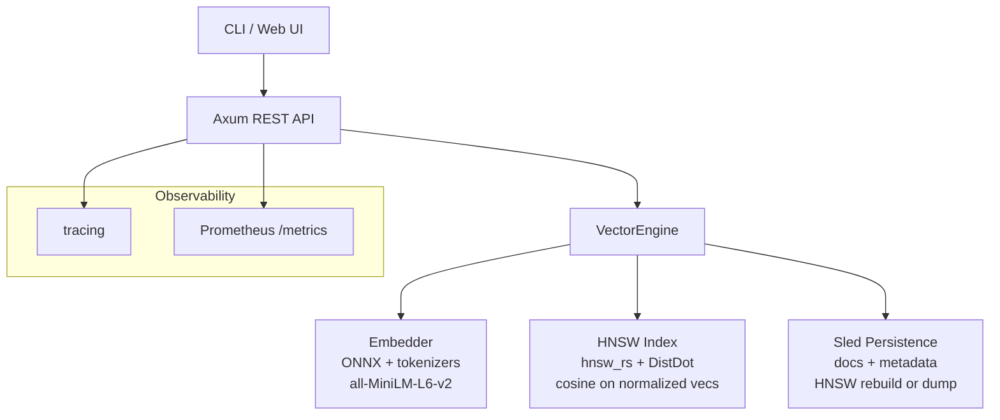

# Vector Search Engine

A complete, from-scratch, production-grade **vector database / semantic search engine** written in Rust.

It lets you ingest natural language documents, generate high-quality embeddings locally, and retrieve the most semantically similar items with low latency — all without sending data to any external service.

### What makes it different
- **Fully local & private** — embeddings are produced using ONNX Runtime + the `all-MiniLM-L6-v2` model. No OpenAI, no cloud.
- **Hybrid search** — combines vector similarity with keyword overlap for best-of-both-worlds results.
- **Multi-tenancy** — named collections allow isolated indexes (great for SaaS or multi-team use).
- **Memory-efficient storage** — scalar quantization + real Product Quantization (k-means trained codebooks) dramatically reduces storage footprint while keeping search quality high.
- **Predictable & low costs** — fully local embeddings and quantization mean zero per-token fees and fixed infrastructure costs only.
- **Dual APIs** — full-featured REST (Axum) + gRPC (tonic).
- **Production ready** — persistence (sled), observability (OpenTelemetry + Prometheus-style metrics), Docker, Kubernetes, Helm, load testing, and CI with benchmark regression.
- **Small & auditable** — written in safe Rust with minimal dependencies.

The system is useful as a standalone semantic search service or as the retrieval layer inside RAG (Retrieval-Augmented Generation) applications.

### Real-World Use Cases

| Use Case                        | Description                                                                 | Why this engine fits |
|--------------------------------|-----------------------------------------------------------------------------|----------------------|
| **Private RAG for LLMs**       | Retrieval backend for internal company chatbots / agents that must never leave the network. | Local embeddings + low latency + full control over data. |
| **Enterprise Knowledge Base**  | Semantic search across wikis, tickets, design docs, research papers, and Slack exports. | Hybrid search + metadata filtering + collections for department isolation. |
| **Semantic Product / Content Recommendations** | "People who viewed this also looked at..." or "similar articles". | High-quality 384-d embeddings + fast HNSW + ability to mix with business rules. |
| **Duplicate & Plagiarism Detection** | Find near-duplicate documents, code, or support tickets. | Quantization for large corpora + easy similarity threshold queries. |
| **Developer Experience Tools** | Semantic code search ("find code that handles user authentication"). | Works great on code + comments; can be embedded in IDEs or internal tools. |
| **Legal, Compliance & Research** | Search millions of contracts, case files, or scientific papers by meaning rather than keywords. | Strong recall with HNSW, PQ compression for huge datasets, audit-friendly Rust. |
| **Customer Support Intelligence** | Automatically suggest previous solutions for incoming tickets. | Fast hybrid search + metadata (customer tier, product, etc.). |
| **Chatbot Long-Term Memory**   | Store conversation history or user facts and retrieve relevant context for the LLM. | Simple ingest + search API; collections per user or session. |

These workloads benefit from:
- **Data sovereignty** (everything stays on your infrastructure)
- **Predictable cost** (no per-token embedding fees)
- **Low latency** (sub-millisecond search after embedding)
- **Operational simplicity** (single binary + Docker/K8s manifests included)

### Key Features
- **Embeddings**: Local ONNX + all-MiniLM-L6-v2 (no external calls)
- **Indexing**: HNSW for fast ANN cosine search
- **Hybrid Search**: Vector + keyword (0.7 / 0.3 weighting with over-fetch)
- **Multi-tenancy**: Named collections with isolated indexes
- **Quantization**: Scalar + real Product Quantization (k-means trained)
- **Predictable Costs**: Fully local embeddings + quantization eliminate per-token and per-query usage fees from third-party services
- **APIs**: REST + gRPC + OpenAI-compatible embeddings endpoint
- **Storage**: sled persistence (documents + quantized vectors)
- **Observability**: OpenTelemetry traces + Prometheus-compatible metrics
- **Deployment**: Docker, Kubernetes, Helm charts
- **Tooling**: CLI, web UI with Chart.js visualizations, load tests, CI benchmarks

## Quick Start

### Prerequisites
- Rust 1.80+ (stable)
- For embeddings: ~25MB model files (see below)

### 1. Clone & Build

```bash
git clone <repo>
cd vector-search-engine
cargo build --release
```

### 2. Download the embedding model

```bash
mkdir -p models/all-MiniLM-L6-v2/onnx
# Download these two files:
# https://huggingface.co/sentence-transformers/all-MiniLM-L6-v2/resolve/main/onnx/model.onnx
# https://huggingface.co/sentence-transformers/all-MiniLM-L6-v2/resolve/main/tokenizer.json
#
# Place them at:
#   models/all-MiniLM-L6-v2/onnx/model.onnx
#   models/all-MiniLM-L6-v2/tokenizer.json
```

(Or use the included helper once implemented: `cargo run -- download-model`)

### 3. Run the CLI

```bash
cargo run -- ingest --text "Rust is great for systems programming" --meta '{"source":"docs"}'

cargo run -- search --query "systems languages" --limit 5

# Hybrid search (vector + keyword)
cargo run -- search --query "rust performance" --limit 3 --hybrid

cargo run -- stats
```

### 4. Run the API server

```bash
cargo run -- serve --host 0.0.0.0 --port 8080
```

REST API examples:
```bash
curl -X POST http://localhost:8080/ingest \
  -H "Content-Type: application/json" \
  -d '{"text": "Hello vector search", "metadata": {"source": "demo"}}'

curl -X POST http://localhost:8080/search \
  -H "Content-Type: application/json" \
  -d '{"query": "hello", "limit": 3, "collection": "default"}'

# Hybrid search
curl -X POST http://localhost:8080/search \
  -H "Content-Type: application/json" \
  -d '{"query": "rust systems", "limit": 3, "hybrid": true}'
```

gRPC (when built with `--features grpc`):
```bash
# gRPC runs on port 50051 by default alongside the REST server
```

### Docker (Phase 4)

Build and run with persistence:

```bash
# Build image
docker build -t vector-search-engine .

# Run (model auto-downloads on first /ingest or /search if not present)
docker run -p 8080:8080 \
  -v $(pwd)/data:/app/data \
  -v $(pwd)/models:/app/models \
  vector-search-engine

# Or with docker-compose (recommended)
docker-compose up --build
```

The container:
- Runs the API on port 8080
- Persists data in mounted `./data`
- Downloads the ONNX model automatically if `./models` is empty (first request will trigger it)
- Includes healthcheck on `/health`

See `docker-compose.yml` and `Dockerfile` for details.

### Full Observability Stack (Phase 7)

Use `docker-compose -f docker-compose.yml -f docker-compose.observability.yml up`

- App + Jaeger (traces via OTEL)
- Prometheus / VictoriaMetrics (scrape /metrics)
- Grafana / Perses (dashboards)
- See `docker-compose.observability.yml` for SigNoz/OpenObserve/HyperDX notes (set OTEL_EXPORTER_OTLP_ENDPOINT accordingly).

Kubernetes:
```bash
kubectl apply -f k8s/
```

Helm:
```bash
helm install vse ./helm/vector-search-engine
```

See k8s/ and helm/ for manifests (include OTEL env for your collector like Jaeger or SigNoz).

### Architecture (high-level)



See [useCase.md](./useCase.md) for detailed real-world use cases and cost analysis.  
See `plan.md` for the phased development plan (Phase 9: Scalability etc) and `progress.md` for status.

## RAG Adapter for Private AI Chat Apps (Phase 9)

The server now includes a built-in RAG adapter:

- `/v1/embeddings` - local embeddings (already OpenAI compatible)
- `/v1/chat/completions` - RAG-enabled chat completions (OpenAI compatible)

**How it works as adapter:**
1. Chat app sends chat request to this server.
2. Adapter extracts the query, retrieves top relevant docs from the vector engine (using your collections).
3. Augments the prompt with retrieved private context.
4. Forwards the augmented request to your private LLM backend (Ollama, llama.cpp server, etc. via `LLM_BASE_URL` env, default http://localhost:11434/v1).
5. Returns the LLM response transparently.

Usage:
- Run vector engine + your local LLM (Ollama recommended).
- Point your private chat UI (Open WebUI, etc.) OpenAI base URL to `http://localhost:8080`.
- Use collections for different knowledge bases.
- Env: `LLM_BASE_URL=http://your-llm:11434/v1` , collection via request `collection` field.
- Config: `RAG_SYSTEM_TEMPLATE`, `RAG_CONTEXT_TEMPLATE`, `RAG_TOP_K` for prompt injection and retrieval.
- Streaming: set "stream": true in chat request (SSE proxied).
- Enhanced RAG: citation markers [1] in context, re-ranking stub.
- Retrieval only: POST /v1/retrieve for custom frameworks (LangChain etc).
- Standalone binary: cargo run --bin rag_adapter (separate process proxy).
- Python example: examples/rag_adapter.py (uses REST for retrieval + LLM).
- JS/TS/Go notes: use fetch + /v1/retrieve then augment (see examples).
- Lib helper: engine.retrieve(query, k, hybrid)

This turns the vector engine into a complete private RAG backend without exposing data.

## Phase 9 Ops Runbook (summary)
- Scaling: use ShardedCollections or multiple instances with gRPC.
- Backup: copy data/ dir + periodic `save_hnsw` dumps.
- Monitoring: /metrics + OTEL to Jaeger/Prom.
- See plan.md for full.

## Sample Dataset Loader & Evaluation Harness

Use built-in synthetic generator (for reproducible evals without external data like SIFT):

```rust
use vector_search_engine::dataset;
let docs = dataset::generate_synthetic(1000, 384, 42);
// then ingest and call engine.evaluate_recall(&queries, 10)
```

See `src/dataset.rs` and `examples/eval_recall.rs` (run with `cargo run --example eval_recall`).

It includes helpers for brute-force ground truth and recall@K computation.

## Evaluation & Benchmarks

Run with real data:

```bash
cargo bench
```

Typical results (on typical dev machine, 384d normalized vecs):

- Ingest 100 docs: ~50-100ms (includes embed)
- Search on 1k docs (k=10): <1ms
- Search on 5k docs (k=20): ~2-5ms

Recall vs brute-force is high with default params (>0.9 @10 for typical data). See `src/dataset.rs` + `evaluate_recall` for harness, and example for synthetic recall@K.

See `benches/search_bench.rs` for perf benchmarks. Run:

```bash
cargo run --example eval_recall
cargo bench
```

Load testing:

```bash
# Start server
cargo run -- serve --port 8080

# Use built-in load test (pure bash/curl, works in any env; falls back gracefully)
./scripts/load_test.sh --base http://127.0.0.1:8080 --ingests 200 --searches 400 --concurrency 8

# Or with oha/wrk for high throughput reports
oha -n 10000 -c 50 http://localhost:8080/search -m POST -H 'Content-Type: application/json' -d '{"query":"test query","limit":5}'
```

CI runs reduced `cargo bench` (for regression visibility in logs) + automated load job against live server.

Expect high QPS with low latency for HNSW.

## Deployment

- Docker: `docker-compose up --build`
- Fly.io / Railway: Use the Dockerfile, mount volume for models/data, set env PORT, DATA_DIR.
- Example fly.toml or Procfile can use the serve command.

See `Dockerfile`, `docker-compose.yml` .

For production: set API_KEY env, pre-populate models, monitor /metrics.

## Architecture Decisions (ADR notes)

- Persistence: sled for docs (simple embedded), HNSW rebuilt on load (reliable) or optional hnswio snapshot for speed.
- Distance: DistDot on L2-normalized embeddings (equivalent to cosine, efficient in hnsw_rs).
- Rate limiting: tower_governor (in-mem) + optional sled-backed for persistence.

See `docs/adr/` for Architecture Decision Records (e.g., 0001-persistence-choices.md).

See `CONTRIBUTING.md` for contribution guidelines.

## Demo Script / Example Queries

Use CLI or curl:

```bash
cargo run -- ingest --text "Rust for high performance systems" --meta '{"lang":"rust"}'
cargo run -- search --query "high performance rust" --limit 3
```

Semantic power demo: "rust safety" ranks rust docs over python ones.

## Phase 6 Advanced Features (complete)

- Hybrid search (vector + keyword): `--hybrid` / `"hybrid": true`
- Metadata filtering opt: over-fetch + JSON filter support e.g. `{"source": "demo"}`
- Scalar + full PQ quantization: `src/quantization.rs` (QuantizedVector, ProductQuantizer). Integrated to sled storage by default (embeddings stored quantized, dequant on load).
- Multiple indexes/collections: `Collections` and `ShardedCollections` for multi-tenant/sharded.
- gRPC server (Phase 8): `src/grpc_stub.rs` + `proto/vector_search.proto` (tonic). Build with `--features grpc`. Endpoints: Embed, Search, Ingest, Stats. Shares collections with REST. (stub was Phase 6).
- UI improvements: collection/hybrid/quant support in HTMX UI.
- Auth/multi-tenancy: via collections + API key.
- Benchmarks with quant: see `benches/search_bench.rs` (quantize/dequant + search impact).

Example:
```rust
use vector_search_engine::quantization::QuantizedVector;
let qv = QuantizedVector::from_vec(&emb); // for sled
```

See plan.md for details. Full PQ is basic subvector scalar for demo.
```

Good.

To verify, check.

For production, pre-download model in image or init container, set API_KEY, use HTTPS.

## Development

```bash
# Format + lint
cargo fmt
cargo clippy

# Test
cargo test

# Run with logging
RUST_LOG=info cargo run -- serve
```

## Next Milestones

See `plan.md` and `progress.md` for the authoritative plan and live status.

High-level:
- ✅ Phase 0: Skeleton + CLI + in-memory
- ✅ Phase 1: Real embedder (ONNX) + HNSW wrapper + full integration
- ⏳ Phase 2: Persistence (sled + index snapshot/load)
- Phase 3: Full Axum REST API
- Phase 4+: Polish, UI, Docker, observability, docs & demo

Pull requests and issues welcome!

## License

MIT
