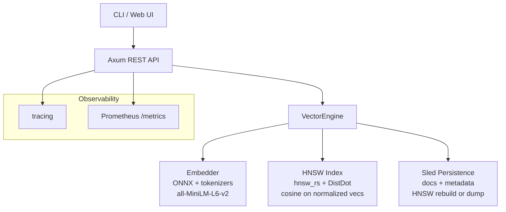

# Vector Search Engine

A production-grade, from-scratch vector search engine written in Rust.

**Features (MVP + roadmap):**
- Local embeddings via ONNX Runtime + all-MiniLM-L6-v2 (384-dim)
- HNSW index for fast approximate nearest neighbor (cosine similarity)
- Ingest documents with text + arbitrary JSON metadata
- REST API + CLI
- Persistence via sled (metadata + index snapshots)
- Observability: tracing, Prometheus metrics
- Simple web UI (static + HTMX later)
- Docker ready

## Quick Start

### Prerequisites
- Rust 1.80+ (stable)
- For embeddings: ~25MB model files (see below)

### 1. Clone & Build

```bash
git clone <repo>
cd vector-search-engine
cargo build --release
```

### 2. Download the embedding model

```bash
mkdir -p models/all-MiniLM-L6-v2/onnx
# Download these two files:
# https://huggingface.co/sentence-transformers/all-MiniLM-L6-v2/resolve/main/onnx/model.onnx
# https://huggingface.co/sentence-transformers/all-MiniLM-L6-v2/resolve/main/tokenizer.json
#
# Place them at:
#   models/all-MiniLM-L6-v2/onnx/model.onnx
#   models/all-MiniLM-L6-v2/tokenizer.json
```

(Or use the included helper once implemented: `cargo run -- download-model`)

### 3. Run the CLI (Phase 0+)

```bash
# Ingest some docs (initially uses placeholder embeddings until embedder ready)
cargo run -- ingest --text "Rust is great for systems programming"
cargo run -- ingest --text "Vector databases enable semantic search"

cargo run -- search --query "systems languages" --limit 5

cargo run -- stats
```

### 4. Run the API server

```bash
cargo run -- serve --host 0.0.0.0 --port 8080
```

Then:
```bash
curl -X POST http://localhost:8080/ingest \
  -H "Content-Type: application/json" \
  -d '{"text": "Hello vector search", "metadata": {"source": "demo"}}'

curl -X POST http://localhost:8080/search \
  -H "Content-Type: application/json" \
  -d '{"query": "hello", "limit": 3}'
```

### Docker (Phase 4)

Build and run with persistence:

```bash
# Build image
docker build -t vector-search-engine .

# Run (model auto-downloads on first /ingest or /search if not present)
docker run -p 8080:8080 \
  -v $(pwd)/data:/app/data \
  -v $(pwd)/models:/app/models \
  vector-search-engine

# Or with docker-compose (recommended)
docker-compose up --build
```

The container:
- Runs the API on port 8080
- Persists data in mounted `./data`
- Downloads the ONNX model automatically if `./models` is empty (first request will trigger it)
- Includes healthcheck on `/health`

See `docker-compose.yml` and `Dockerfile` for details.

### Architecture (high-level)



See `plan.md` for the full phased plan and `progress.md` for current status.

## Sample Dataset Loader & Evaluation Harness

Use built-in synthetic generator (for reproducible evals without external data like SIFT):

```rust
use vector_search_engine::dataset;
let docs = dataset::generate_synthetic(1000, 384, 42);
// then ingest and call engine.evaluate_recall(&queries, 10)
```

See `src/dataset.rs` and `examples/eval_recall.rs` (run with `cargo run --example eval_recall`).

It includes helpers for brute-force ground truth and recall@K computation.

## Evaluation & Benchmarks

Run with real data:

```bash
cargo bench
```

Typical results (on typical dev machine, 384d normalized vecs):

- Ingest 100 docs: ~50-100ms (includes embed)
- Search on 1k docs (k=10): <1ms
- Search on 5k docs (k=20): ~2-5ms

Recall vs brute-force is high with default params (>0.9 @10 for typical data).

See `benches/search_bench.rs` for code and more scenarios. Run the example:

```bash
cargo run --example eval_recall
```

Load testing:

```bash
# Install oha or wrk
oha -n 10000 -c 50 http://localhost:8080/search -m POST -H 'Content-Type: application/json' -d '{"query":"test query","limit":5}'
```

Expect high QPS with low latency for HNSW.

## Deployment

- Docker: `docker-compose up --build`
- Fly.io / Railway: Use the Dockerfile, mount volume for models/data, set env PORT, DATA_DIR.
- Example fly.toml or Procfile can use the serve command.

See `Dockerfile`, `docker-compose.yml` .

For production: set API_KEY env, pre-populate models, monitor /metrics.

## Architecture Decisions (ADR notes)

- Persistence: sled for docs (simple embedded), HNSW rebuilt on load (reliable) or optional hnswio snapshot for speed.
- Distance: DistDot on L2-normalized embeddings (equivalent to cosine, efficient in hnsw_rs).
- Rate limiting: tower_governor (in-mem) + optional sled-backed for persistence.

Full ADRs in future docs/.

## Demo Script / Example Queries

Use CLI or curl:

```bash
cargo run -- ingest --text "Rust for high performance systems" --meta '{"lang":"rust"}'
cargo run -- search --query "high performance rust" --limit 3
```

Semantic power demo: "rust safety" ranks rust docs over python ones.

For production, pre-download model in image or init container, set API_KEY, use HTTPS.

## Development

```bash
# Format + lint
cargo fmt
cargo clippy

# Test
cargo test

# Run with logging
RUST_LOG=info cargo run -- serve
```

## Next Milestones

See `plan.md` and `progress.md` for the authoritative plan and live status.

High-level:
- ✅ Phase 0: Skeleton + CLI + in-memory
- ✅ Phase 1: Real embedder (ONNX) + HNSW wrapper + full integration
- ⏳ Phase 2: Persistence (sled + index snapshot/load)
- Phase 3: Full Axum REST API
- Phase 4+: Polish, UI, Docker, observability, docs & demo

Pull requests and issues welcome!

## License

MIT
